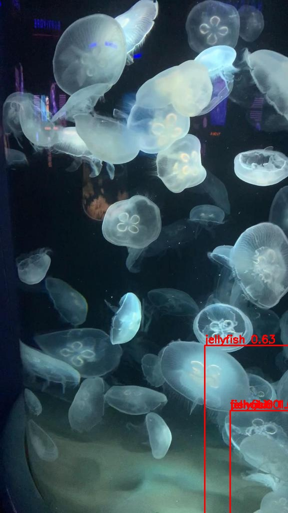
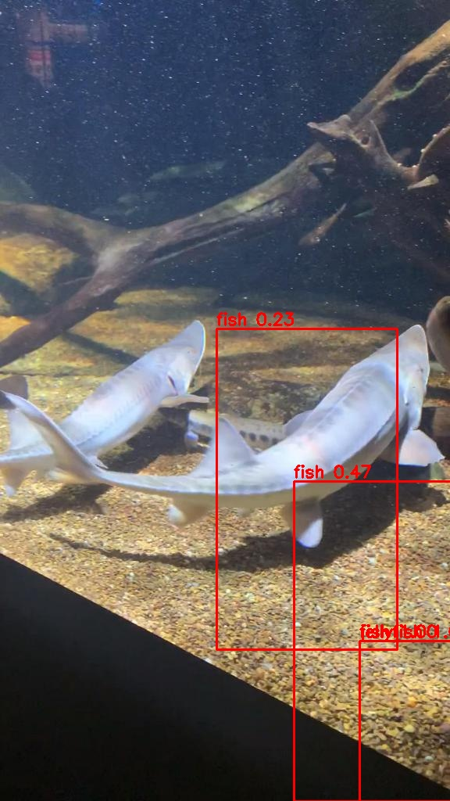

This project presents an end-to-end object detection pipeline built entirely from scratch for underwater imagery. A custom dataset containing seven object classes—fish, jellyfish, penguin, puffin, shark, starfish, and stingray—was used, with images annotated in YOLO format and split into training, validation, and test sets.

A lightweight convolutional neural network (CNN) backbone was designed to extract spatial features using strided convolutions instead of pooling, enabling learnable downsampling and improved feature representation. The detector follows a single-stage, grid-based architecture, where each grid cell predicts bounding box coordinates, objectness confidence, and class probabilities.

### Results

  
  

